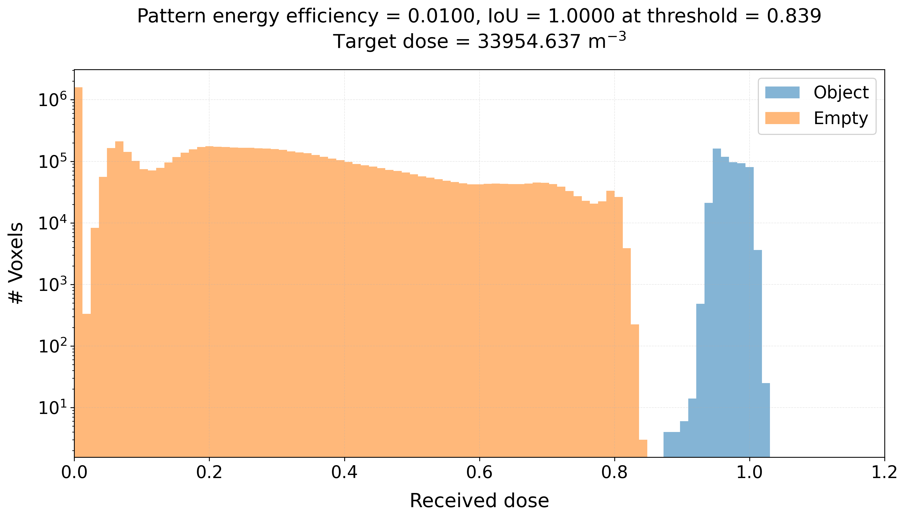

.. _energy_dose_estimation:

Energy Dose Estimation
======================

In 3D printing people often report a energy dose with units of ``J/cm^2`` or ``W/cm^2``. While this is appropriate for DLP or SLA printer, it is not appropriate for 
Tomographic or volumetric printing.

The correct energy dose is given by energy per unit volume, which has units of ``J/cm^3``. Of course, this dose depends heavily on the used chemistry and circumstances of the print.

But: given a setup, the printing time, the projection power and a set of patterns, how can we estimate the energy dose?

This cannot be done by a simple analytical equation as TVAM patterns are designed in such a way that the energy is distributed in a non-trivial way. Instead, we need to use the specific physical parameters (attenuation coefficient, projection power, printing time) and the patterns to estimate the energy dose.

In principle the steps are:

1. For the set of patterns we know the energy efficiency which is the fraction of the projection power that is actually transmitted through the projector. This tells us how much energy is actually projected into the resin. Note, not all energy is used for actualy target polymerization as some light is transmitted and some light is absorbed in void voxels.
2. With Dr.TVAM we know the amount of absorbed energy in object voxels and the amount transmitted through the object voxels.
3. We can sum up the energy dose of all object voxels and can divide it by the total volume of the object voxels to get the average energy dose in ``1/cm^3``.
4. Finally, this `dimensionless` energy dose can be multiplied by total projector power and printing time to get the energy dose in ``W * s / cm^3 = J/cm^3``.

This results in an *average* energy dose of the object voxels. Since the typical TVAM energy dose is not perfectly homogenous (e.g. 0.9 to 1), some parts can receive often 10% more energy than the average, while other parts receive 10% less energy than the average.

Specific example
----------------

Looking at this histogram, we can find the value ``Target dose = 33954 1/m^3``.

In this case our projector has a size of ``400x400 pixels`` and the total power is ``100mW``. The printing time is ``10s``.

So if we multiply all values, we obtain the theoretical correct volumetric dose in ``J/m^3``: 

.. math::

   \text{Energy dose} = \text{Target dose} \times \text{Projection power} \times \text{Printing time} =\\ 33954\ \frac{1}{\mathrm{m}^3} \times 0.1\ \mathrm{W} \times 10\ \mathrm{s} = 33954\ \frac{\mathrm{J}}{\mathrm{m}^3} = 33\ \frac{\mathrm{mJ}}{\mathrm{cm}^3}

Important notes
---------------
You always need to measure the projection power of the same size as in your simulation.
If you similate with 1024x768, then you need to turn on all pixels inside 1024x768 and measure the power of this region if fully on!
You also need to set the physical correct attenation coefficient in the config files. If the printing time is too long, see our :ref:`tutorial <sparsity_tips>`  to increase energy efficiency of your patterns.
