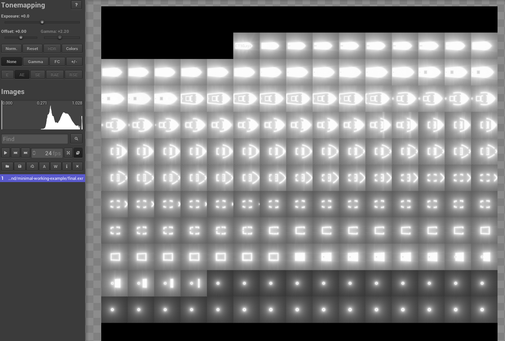
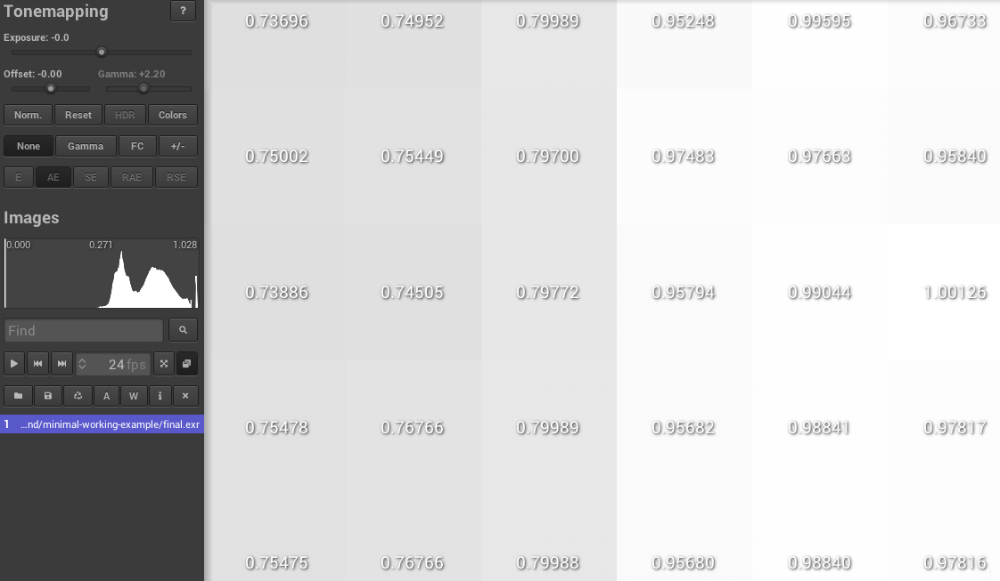
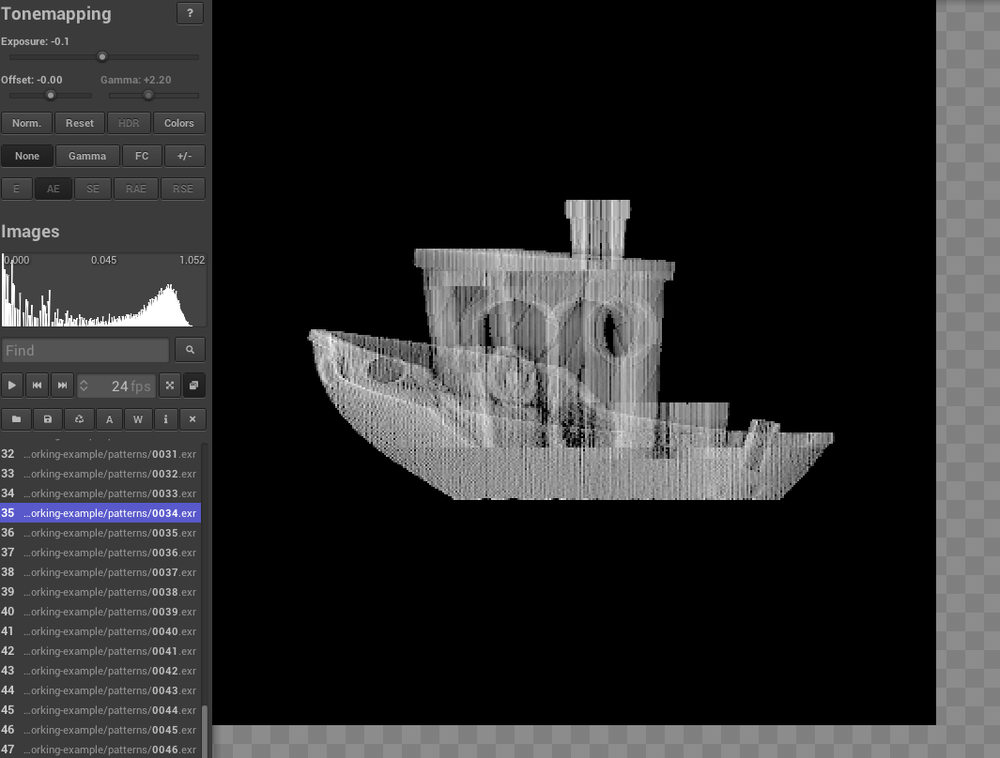

.. _hello_print:

Hello Print - First steps
=========================
In principle Dr.TVAM can be used via a high-level commandline interface and all printing parameters are defined in a ``config.json`` config file. This tutorial will guide you through the first steps of using Dr.TVAM with a simple example. We will optimize the patterns to print a 3D Benchy, which is a standard test model in 3D printing.

Python installation
-------------------
First, install a Python environment (Python, Anaconda, uv, ...) and then install the latest Dr.TVAM version from PyPI:

.. code-block:: bash

    pip install drtvam

Or the latest master version from GitHub:

.. code-block:: bash

     pip install git+https://github.com/rgl-epfl/drtvam 

The pattern optimization can be computational quite demanding, so we recommend to use a NVIDIA GPU. Something like a RTX 2060, 3060, 4060 or better should be sufficient for the first steps. You can also use a CPU, but it will be much slower.

Typically on a CUDA GPU this can be in the range of seconds to hours. For a CPU, it can be in the range of minutes to days, depending on the complexity of the target shape and the number of optimization steps.

Simple example
--------------
Download the :download:`3D Benchy file <resources/benchy.ply>` to get started. Then, create a file named ``config.json`` with the content below.

To launch the optimization, run the following command in the terminal (Anaconda terminal, PowerShell, or any terminal of your choice where the Python environment is activated):

.. code-block:: bash

    drtvam config.json

Or on the CPU (not recommended):

.. code-block:: bash

    drtvam config.json --backend=llvm

Config file
-----------

.. raw:: html

   

   
<a>Config file (click to expand)</a>

.. code-block:: json

    {
        "vial": {
            "type": "cylindrical",
            "r_int": 7,
            "r_ext": 8,
            "ior": 1.5,
            "medium": {
                "ior": 1.4849,
                "extinction": 0.054,
                "albedo": 0.0
            }
        },
        "projector": {
            "type": "collimated",
            "n_patterns": 100,
            "resx": 400,
            "resy": 400,
            "pixel_size": 0.02,
            "motion": "circular",
            "distance": 20
        },
        "sensor": {
            "type": "dda",
            "scalex": 4,
            "scaley": 4,
            "scalez": 4,
            "film": {
                "type": "vfilm",
                "resx": 200,
                "resy": 200,
                "resz": 200
            }
        },
        "target": {
            "filename": "benchy.ply",
            "size": 4.0
        },
        "loss": {
            "type": "threshold",
            "tl": 0.80,
            "tu": 0.95
        },
        "n_steps": 30,
        "transmission_only": true,
        "regular_sampling": true,
        "filter_radon": true,
        "spp": 1,
        "spp_ref": 1,
        "spp_grad": 1
    }

.. raw:: html

   

In summary, the config file contains the following sections:

- ``vial``: describes the vial geometry and material properties. With ``r_int=7mm`` and ``r_ext=8mm``, the vial has a thickness of ``1mm``. The inner radius is ``7mm``, and the outer radius is ``8mm``. The index of refraction (``ior``) of the vial material is set to ``1.5``, which is typical for glass. The medium inside the vial has an ior of ``1.4849``, an extinction coefficient of ``0.054 1/mm``, and an ``albedo`` of ``0.0``, which means it absorbs light without scattering.
- ``projector``: describes the projector geometry and motion. The projector is collimated, meaning it emits parallel rays. It will project 100 patterns with a resolution of ``400x400`` pixels, and each pixel has a size of ``0.02mm``, which means the projected area is ``8mm x 8mm``. The projector will move in a circular motion around the vial at a ``distance`` of ``20mm``.
- ``sensor``: describes the volumetric voxel grid used for the optimization. The sensor is a DDA (Digital Differential Analyzer) type, which is a method for ray tracing in a voxel grid. The voxel grid has a scale of 4 in all dimensions, meaning each voxel represents a ``0.02mm x 0.02mm x 0.02mm`` volume. The film is a volumetric film (vfilm) with a resolution of ``200x200x200 voxels``, which means the total volume covered by the sensor is ``4mm x 4mm x 4mm``. The voxel size should be equal to the pixel size of the projector to ensure that the projected patterns are properly sampled by the sensor.
- ``target``: describes the target shape to be reconstructed. The target is specified by a filename (the path to the 3D model file) and a size, which is the maximum dimension of the target in millimeters. In this case, the target will be scaled to fit within a ``4mm x 4mm x 4mm`` box.
- ``loss``: describes the loss function used for optimization. The loss is of type ``threshold``, meaning that object voxels should receive a dose between ``tu=0.95`` and 1. Void voxels should stay below ``tl=0.80``. The loss will penalize doses that are outside these thresholds, encouraging the optimization to find patterns that produce a dose distribution that matches the target shape.
- ``n_steps``: the number of optimization steps to perform. In this case, the optimization will run for 30 steps.
- ``transmission_only``: a boolean flag that indicates whether to optimize only for transmission (true) or also for scattering (false). In this case, it is set to true, meaning that the optimization will focus solely on matching the transmission of the target shape.

Analyzing the results
----------------------
The optimimization will run for 30 steps, and at the end of the optimization, you will find the following files in the output directory. On this NVIDIA RTX 3060 GPU, the optimization takes a few seconds:

 
.. code-block:: bash

    No optimizer specified. Using linear L-BFGS.
    Optimizing patterns...
    100%|██████████████████████████████| 30/30 [00:04<00:00,  6.28it/s, loss=[5.008113]]
    Rendering final state...
    Saving images...
    100%|██████████████████████████████| 100/100 [00:00<00:00, 345.41it/s]
    Pattern efficiency 0.0100
    Finding threshold for best IoU ...
    100%|██████████████████████████████| 300/300 [00:00<00:00, 911.53it/s]
    Best IoU: 1.0000
    Best threshold: 0.839130

Output files
------------
Dr.TVAM outputs several files in the same folder as the config file, which contain the results of the optimization.
For analyzing the files we recommend the `tev <https://github.com/Tom94/tev/>`_ viewer, which can be used to visualize the .exr files. The .npz files can be loaded in Python using NumPy.

- ``final.exr``: the final dose for each slice of the volume. The dose is a measure of the amount of light energy deposited in each voxel.
- ``target.exr``: the theoretical target slices corresponding to the target shape. This is what we want to achieve with the optimization after we threshold the dose (``final.exr``).
- ``patterns``: the folder containing the images ``0000.exr``, ``0001.exr``, ..., ``0099.exr``, which are the 100 optimized patterns projected by the projector.
- ``histogram.png``: the histogram of the void and object voxels in the final reconstruction, which can be used to find the optimal threshold for the print
- ``patterns.npz`` and patterns_normalized_uint8.npz: the optimized patterns in NumPy format, which can be used to load onto the projector for printing.

Here is an example of how the final dose looks like in the tev viewer when we open ``final.exr``. Each small square is a axial slice of the volume:

We can also zoom in to see the details of the dose distribution. In experiment we would choose a threshold that only values above 0.9 are printed, which means that only the voxels that receive a dose above 0.9 will be solidified. In this case, we can see that the object voxels receive a dose above 0.9, while the void voxels receive a dose below 0.8, which typically works well for printing with acrylates:

And we can also load the patterns in the tev viewer to see how they look like. Note, there is a gamma correction applied to enhance low values.

And also the histogram of the final reconstruction where we can see the separation between the void and object voxels. The IoU is 1 which indicates perfect separation resulting in a perfect print:

.. image:: resources/histogram_minimal.png
  :width: 600
